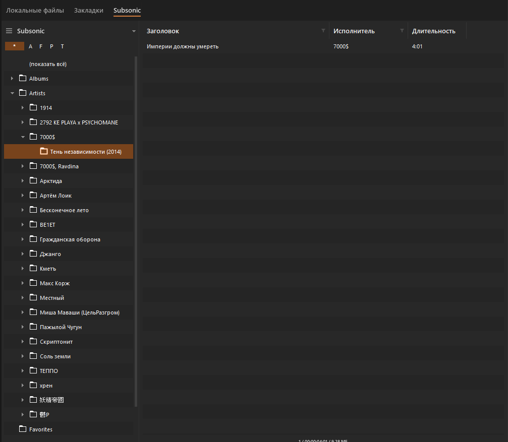
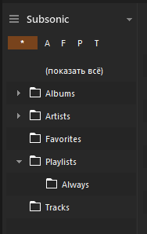
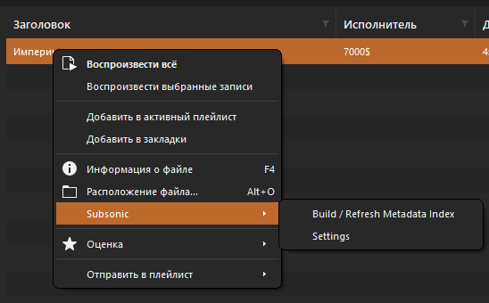
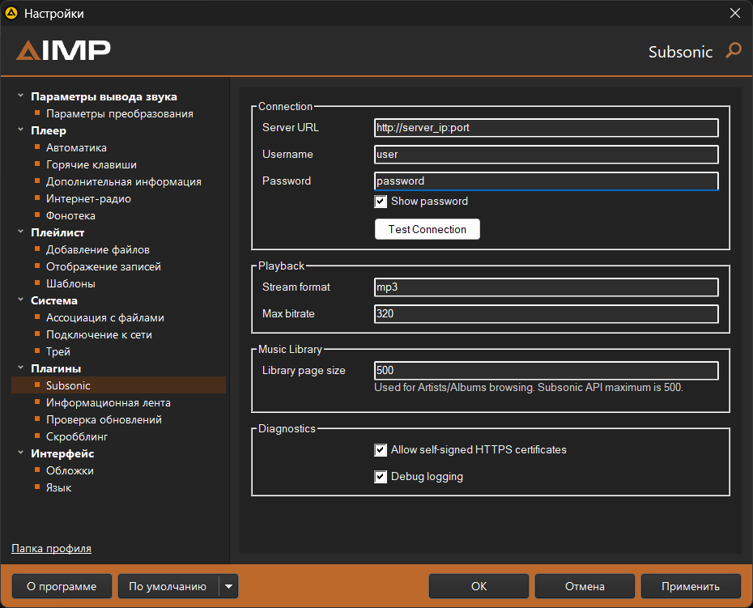

# AIMP Subsonic Plugin

[English](README.md) | [Русский](README.ru.md)

Нативный плагин для AIMP Desktop 5.40+, который добавляет поддержку Subsonic-совместимых музыкальных серверов. Основная проверка велась с Navidrome, а цель проекта - сделать удалённую Subsonic-библиотеку похожей на обычный источник в фонотеке AIMP.

Текущая версия: `1.0.0`.

Ветка `main` - стабильная онлайн-ветка. Основной режим воспроизведения сейчас: прямые Subsonic stream URL. Оффлайн-кеш аудио намеренно не включён в эту ветку, пока он не станет достаточно стабильным для обычных пользователей.

## Возможности

- Отдельное хранилище `Subsonic` в фонотеке AIMP.
- Просмотр плейлистов, исполнителей, альбомов, избранного и треков.
- Воспроизведение из центральной таблицы обычным поведением AIMP: двойной клик, drag/drop или добавление строк в плейлист.
- Прямое воспроизведение через `/rest/stream.view` с настройкой формата и максимального битрейта.
- Постоянный индекс метаданных для треков, исполнителей, альбомов, плейлистов, избранного и порядка треков в альбомах/плейлистах.
- Фоновая команда `Build / Refresh Metadata Index`.
- Быстрый поиск в центральной таблице фонотеки.
- Серверные плейлисты доступны для просмотра в фонотеке; их треки можно воспроизводить или добавлять обычными действиями AIMP.
- Subsonic scrobble: now-playing и played-события.
- Провайдер обложек через `getCoverArt` с локальным кешем изображений.
- Страница настроек в AIMP Options: подключение, воспроизведение, фонотека, TLS, диагностика.
- Token-auth: `t=md5(password + salt)`, `s=<salt>`, `v=1.16.1`, `c=aimp-subsonic`, `f=json`.
- Хранение пароля в настройках AIMP через Windows DPAPI.
- Опциональный локальный `subsonic.local.json` для разработки.
- Диагностический лог с редактированием auth-параметров.

## Скриншоты

### Фонотека



### Структура библиотеки



### Команды Subsonic



### Настройки



## Чего нет в 1.0.0

- Оффлайн-воспроизведения аудио и аудио-кеша.
- Воспроизведения через виртуальные `subsonic://` cache URI.
- Импорта, создания, обновления, удаления и автоматической синхронизации серверных плейлистов.
- Подкастов, видео, jukebox, чата, bookmarks и OpenSubsonic-only расширений.

## Сборка

Проект использует CMake, C++17, Visual Studio 2022/2026 Build Tools и официальный AIMP SDK v5.40. CMake ищет SDK в:

- `-DAIMP_SDK_DIR=...`
- `%AIMP_SDK_DIR%`
- `third_party/aimp_sdk`
- `build/_deps/aimp_sdk_v540`
- `%TEMP%/aimp_sdk_v540`

Если SDK не найден и включён `AIMP_SDK_AUTO_DOWNLOAD=ON`, CMake скачает его в `build/_deps`.

Настройка и сборка:

```powershell
cmake -S . -B build -G "Visual Studio 18 2026" -T host=x64 -A x64
cmake --build build --config Release --target aimp_subsonic
```

Сухие тесты:

```powershell
cmake --build build --config Release --target aimp_subsonic_node_tests aimp_subsonic_security_tests
build\Release\aimp_subsonic_node_tests.exe
build\Release\aimp_subsonic_security_tests.exe
```

Для 32-битного AIMP настройте проект с `-A Win32`.

## Установка

Скопируйте release DLL в:

```text
AIMP\Plugins\aimp_subsonic\aimp_subsonic.dll
```

После этого перезапустите AIMP.

Если AIMP сохраняет старую информацию о плагине после замены DLL, закройте AIMP и удалите записи `aimp_subsonic.dll` из секций `[Plugins]` и `[Plugins.CachedInfo]` в `%APPDATA%\AIMP\AIMP.ini`. При следующем запуске AIMP заново просканирует DLL.

## Настройка

Откройте настройки AIMP и выберите `Плагины -> Subsonic`.

Обязательные поля:

- Server URL, например `https://music.example.com` или `http://192.168.0.10:4533`
- Username
- Password

Полезные значения по умолчанию:

- Stream format: `mp3`
- Max bitrate: `320`
- Library page size: `500`
- Debug logging: выключено
- Allow self-signed HTTPS certificates: выключено

Опцию самоподписанных сертификатов стоит включать только для доверенного личного сервера. Она отключает проверку TLS-сертификата для WinHTTP-запросов самого плагина. Прямые URL воспроизведения передаются в AIMP, поэтому его собственная сетевая подсистема может вести себя по-своему.

## Локальный конфиг для разработки

Если настройки AIMP пустые, плагин может прочитать `subsonic.local.json` рядом с DLL:

```json
{
  "serverUrl": "https://music.example.com",
  "username": "user",
  "password": "password",
  "streamFormat": "mp3",
  "maxBitRate": 320,
  "libraryPageSize": 500,
  "ignoreTlsCertificateErrors": false,
  "debugLogging": false
}
```

Этот файл намеренно добавлен в `.gitignore`.

## Первый запуск

1. Настройте сервер в AIMP Options.
2. Откройте фонотеку AIMP и переключитесь на `Subsonic`.
3. Запустите `Subsonic -> Build / Refresh Metadata Index`.
4. Откройте плейлисты, исполнителей, альбомы, избранное или треки.
5. Используйте обычный двойной клик AIMP или drag/drop для воспроизведения и добавления треков.

## Логи

Если включить debug logging, лог будет записываться рядом с DLL:

```text
aimp_subsonic.log
```

Auth-параметры вроде `u`, `p`, `t`, `s`, `password`, `token`, `salt` и `Authorization` редактируются перед записью в лог.

## Статус

Это первый публичный релиз. Его лучше воспринимать как практичный community-релиз, а не как финальный полный Subsonic-клиент: просмотр библиотеки, воспроизведение, метаданные, обложки, настройки, просмотр серверных плейлистов и scrobble уже реализованы, а оффлайн-кеш аудио, редактирование/синхронизация плейлистов и более глубокие OpenSubsonic-возможности планируются на следующие этапы.

## TODO / Roadmap

- Довести до стабильного состояния оффлайн-кеш аудио и оффлайн-плейлисты AIMP в отдельной dev-ветке.
- Добавить безопасное явное редактирование серверных плейлистов и UX синхронизации локальных плейлистов на сервер.
- Добавить опциональные возможности OpenSubsonic: тексты песен, bookmarks и play queue.
- Улучшить пользовательские уведомления и сообщения об ошибках сети, авторизации и сервера.
- Добавить больше dry integration тестов с моками ответов Subsonic/Navidrome.
- Подготовить release-архивы для более простой установки.
